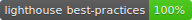

## FCAIH GPA calculator

Demo: [ahmeed2m.github.io/helwan-gpa](https://ahmeed2m.github.io/helwan-gpa)

Made with ReactJS.
Lives up to [Google's Progressive Web App Checklist](https://developers.google.com/web/progressive-web-apps/checklist).

Installable from PWA compatible mobile browser. Works offline.

`
Made using react hooks API.
`
